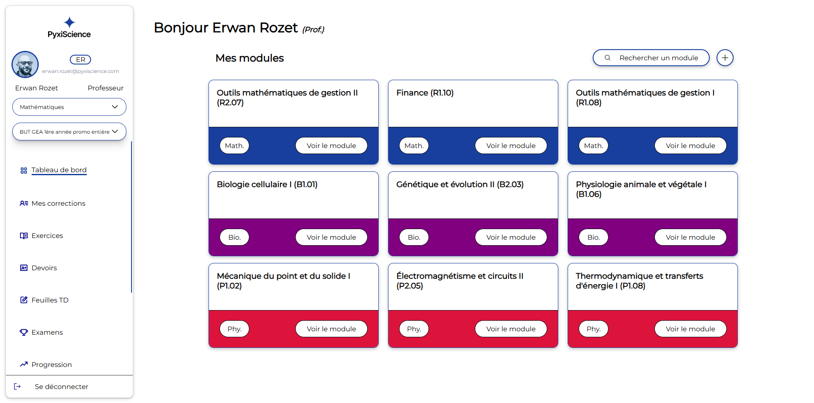

# Project Inspired by Pyxiscience

This project is a partial reproduction of the Pyxiscience platform interface, with some graphical and functional liberties. It was developed as a personal project to familiarize myself with their tech stack and UX approach.  
**_Due to the very short development timeframe, only a few features are implemented, and the GraphQL API is just a learning POC._**

## Goals

- Reproduce a section of the platform with consistent UX
- Explore possible interactions (navigation, cards, etc.)
- Use the same technologies

## Tech Stack

- **Next.js (React)**
- **NestJS**
- **Prisma**
- **GraphQL**
- **Turborepo**

## Included Features

- Module interface with dynamic cards
- Sidebar with active navigation links
- Reusable components for forms, layout, etc.
- Dynamic routing system (Next.js)

## Preview



## Notes

- The project was built without access to the original source code.
- Design choices are based on publicly available elements (screenshots from [Pyxiscience’s website](https://pyxiscience.com/)).
- Goal: demonstrate my technical skills and adaptability to a new stack.

## Prerequisites

- [Node.js](https://nodejs.org/) (LTS recommanded)
- [pnpm](https://pnpm.io/) (If you don't already have it `npm install -g pnpm`)

## Installation

_At the root of the repo:_

Install dependencies with `pnpm i`:

```bash
pnpm i
```

Serve dev `pnpm dev` :

```bash
pnpm dev
```

[API](http://localhost:3000/graphql)
[Web](http://localhost:3001/dashboard)
